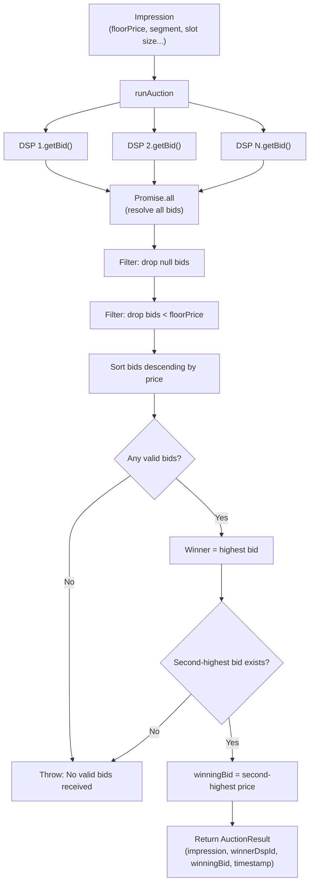
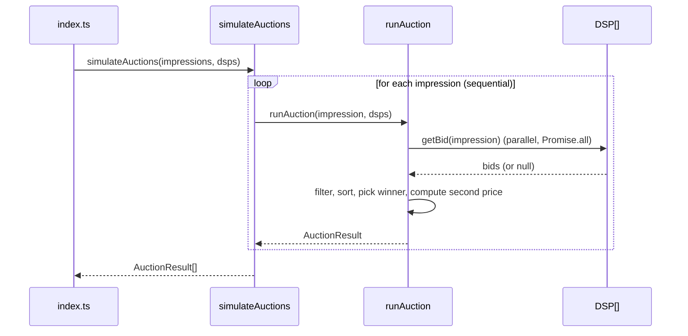

# Auction Simulator

A small TypeScript simulator for programmatic advertising (RTB-style) auctions. It models an ad **exchange** that takes a list of **impressions** (ad slots to be filled) and a list of **DSPs** (Demand-Side Platforms — the "bidders"), runs a **second-price auction** for each impression, and reports who won and what they pay.

## Project structure

| Path | Responsibility |
| --- | --- |
| `src/types.ts` | Domain model: `Impression`, `DSP`, `DSPBidResponse`, `Bid`, `AuctionResult`. |
| `src/dsp/*.ts` | Mock DSPs (`AmazonDSP`, `GoogleAdsDSP`, `MagniteDSP`, `ProgrammaticDirectDSP`, `TradesDeskDSP`). Each implements `DSP.getBid(impression)` with its own hard-coded per-segment pricing, and may return `null` to decline a bid. |
| `src/impressions.ts` | 10 hard-coded mock `Impression` records (publisher, slot size, user segment, location, floor price) used as simulation input. |
| `src/exchange.ts` | The auction engine — see below. |
| `src/index.ts` | Entry point: builds the DSP list, runs `simulateAuctions(mockImpressions, mockDsps)`, and logs the results. |

## Running it

Install dependencies with pnpm, then run the entry point with `tsx` (there is no `dev`/`start` script defined in `package.json` yet, so invoke it directly):

```bash
pnpm install
pnpm exec tsx src/index.ts
```

## Auction logic (`src/exchange.ts`)

The module exposes one public function, `simulateAuctions`, which drives a private helper, `runAuction`, once per impression.

1. **`simulateAuctions(impressions, dsps)`** iterates over every `impression` **sequentially** (a `for...of` loop with `await`), running one auction at a time and collecting each `AuctionResult` into an array that's returned once all impressions have been processed.

2. **`runAuction(impression, dsps)`** — for a single impression:
   1. **Solicit bids in parallel.** Every DSP's `getBid(impression)` is called concurrently via `dsps.map(...)` + `Promise.all`, so slow DSPs don't block each other.
   2. **Drop non-bids.** Responses where the DSP returned `null` (declined to bid) are filtered out.
   3. **Enforce the floor price.** Remaining bids below `impression.floorPrice` are filtered out too — this is the publisher's reserve price.
   4. **Rank the bids.** The surviving valid bids are sorted descending by `price`.
   5. **Pick the winner.** The top bid (`sortedBids[0]`) is the winner. If there are no valid bids at all, the function throws (`No valid bids received for impression: <id>`).
   6. **Compute the clearing price (second price).** In a second-price auction, the winner doesn't pay their own bid — they pay the **second-highest** bid (`sortedBids[1]`). This rewards truthful bidding and is the same mechanism used by real ad exchanges.
   7. **Return the result:** `{ impression, winnerDspId, winningBid: secondPrice, timestamp }`, where `winningBid` is actually the second-highest price, not the winner's own bid.

> **Known limitation:** if exactly one DSP clears the floor price, there is a winner but no second bid to derive a clearing price from. The current implementation throws the same "No valid bids received" error in that case, even though a winner technically exists. This is documented here as the exchange's current behavior rather than something this README changes.

### Diagram



The sequence below shows how a full simulation run drives many single-impression auctions:


